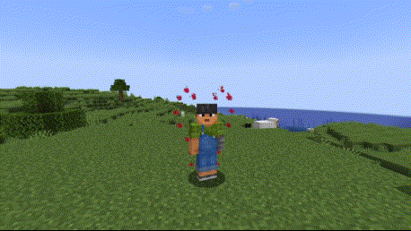

# Jarticle

Jarticle is a PaperMC plugin that allows you to create particle animations and hook them to entities on specific events. As example, playing an animation of particles when player flies on specific elytra, or shooting an arrow from a specific bow, or just having a permission which would constantly play a particle animation around the player.

The configuration abilities are quite flexible, so you can be creative with the animations you create.

For more information visit the [Wiki](https://github.com/execsuroot/jarticle/wiki).
